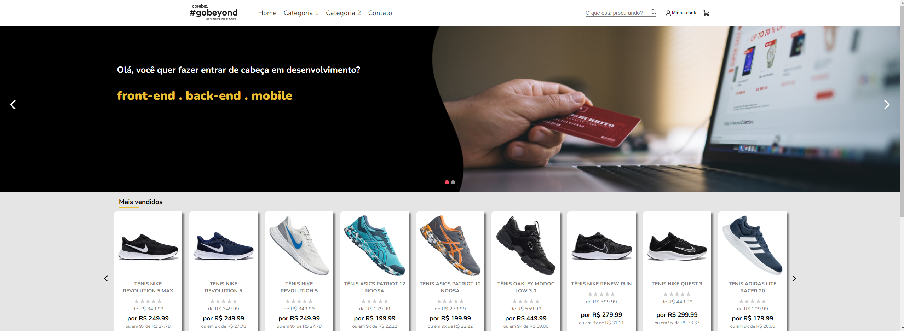

<h1 align="center">
  
</h1>

<p align="center">
  <a href="#-tecnologias">Tecnologias</a>&nbsp;&nbsp;&nbsp;|&nbsp;&nbsp;&nbsp;
  <a href="#-projeto">Projeto</a>&nbsp;&nbsp;&nbsp;|&nbsp;&nbsp;&nbsp;
  <a href="#-layout">Layout</a>&nbsp;&nbsp;&nbsp;|&nbsp;&nbsp;&nbsp;
</p>

<br>

<p align="center">
  
</p>

<br/>

<p align="center">
  Projeto desenvolvido para seleção do programa Gobeyond da Corebiz!
</p>

<br/>

## 🚀 Tecnologias

Esse projeto foi desenvolvido com as seguintes tecnologias:

- HTML
- CSS
- JavaScript
- ReactJS

## 💻 Projeto

### Gobeyond

Fazer o layout da loja e implementar algumas funcionalidades disponivies no layout que esta disponivel logo abaixo. Para visualizar como o projeto ficou clique nesse link: [Projeto](https://go-beyond-shop.vercel.app/)

Siga os passos abaixo caso você queira rodar o projeto na sua maquina:
```bash
#Clone the repository
$ git clone https://github.com/Everton-Afonso/CorebizDesafio-1.git

# Install the dependencies
$ npm i or yarn

# Start the project
$ yarn start
```

## 🔖 Layout

Você pode visualizar o layout do projeto clique nesse link: [Figma](https://www.figma.com/file/Q6R28bCLDpizGZT6YvJGcm/Corebiz---Go-Beyond-2021?node-id=1%3A218).
